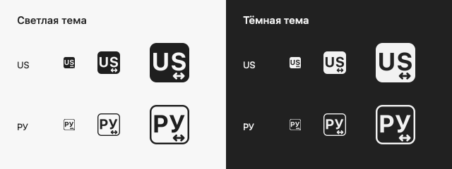

ru-en-cross
===========

`ru-en-cross` — это пара русско-английских раскладок для macOS, в
которых `Option` временно включает противоположную раскладку.

В обычном режиме они используют таблицы системных `U.S.` и `Russian – PC`
с исправлением кириллической `Ё` на ANSI-клавиатурах.
Если удерживать `Option`, клавиши основного блока печатают символы из
другой раскладки: из русской можно быстро набрать английское слово или
поставить `;`, а из английской — вставить русский фрагмент без полного
переключения источника ввода.

Зачем
-----

В пользовательских раскладках `Option` часто отдают под типографский
слой: тире, кавычки, специальные пробелы и другие редкие символы. Для
разработки такой слой обычно менее важен, чем быстрый доступ ко второму
языку и знакам препинания.

`ru-en-cross` использует `Option` как временное переключение языка. Это
удобно, когда нужно коротко набрать слово, имя переменной, команду,
фрагмент комментария или отдельный знак из другой раскладки, не меняя
текущий источник ввода.

Как работает
------------

* Без модификаторов раскладки повторяют свои базовые варианты: `U.S.` и
  `Russian – PC`.
* `Option` включает слой противоположной раскладки.
* `Option` + `Shift` включает тот же противоположный слой, но с учетом
  `Shift`: буквы меняют регистр, а знаки берутся из shifted-уровня
  другой раскладки.
* Цифровой ряд с `Option` и `Option` + `Shift` ведет себя как в
  противоположной раскладке.
  * `Option` + `1` в обеих раскладках дает `1`, а
    `Option` + `Shift` + `1` — `!`.
  * `Option` + `Shift` + `4` в русской раскладке берется из
    `U.S.` и дает `$`, а в английской — из `Russian – PC` и дает `;`.
* Caps Lock в `Option`-слое не меняет выбранный слой: `Option` использует
  обычный противоположный слой, а `Option` + `Shift` — shifted-слой
  противоположной раскладки.
* Левые и правые `Option`, `Shift` и `Control` работают одинаково.
* `Command` включает латинский QWERTY для сочетаний клавиш в обеих
  раскладках. `Command` + `Shift` использует верхний регистр и shifted-знаки.
  Добавление `Option` или Caps Lock не переключает язык этих сочетаний.
* `Control` имеет приоритет над остальными модификаторами и использует
  системный управляющий слой `U.S.`: например, `Control` + `C` даёт
  управляющий символ U+0003, `Control` + `[` — Escape.
* Цифровой блок сохраняет базовую раскладку, включая десятичный разделитель.
  Return, Tab, Backspace, Delete и стрелки сохраняют свои служебные коды.
* Поддерживаются ANSI, ISO и JIS. Положение `ё` учитывает тип клавиатуры:
  на ANSI это клавиша слева от `1`, на ISO — дополнительная клавиша
  рядом с левым Shift. Верхний регистр всегда даёт кириллическую `Ё`.

Примеры
-------

* В `Russian – PC` можно удерживать `Option` и набрать короткий
  английский фрагмент без переключения на `U.S.`.
* В `Russian – PC` сочетание `Option` + `;` печатает `;`, а `Option` +
  `Shift` + `;` печатает `:`.
* В `U.S.` можно удерживать `Option` и набрать русский фрагмент теми же
  физическими клавишами, что и в `Russian – PC`.

Иконки
------

Монохромные `US` и `РУ` в стиле системных значков macOS 26.5.2,
с маленькой отметкой `↔` внизу справа. Она обозначает перекрёстный ввод
и позволяет отличать раскладки от штатных.



Обе иконки используют жирный системный шрифт и занимают весь холст 16 × 16.
У `РУ` прозрачный фон с контурной рамкой; у `US` буквы и стрелка
вырезаны в сплошной подложке. Значки помечены
`TISIconIsTemplate` для адаптации к теме и выделению в меню.
В ICNS есть отдельные варианты для обычных и Retina-экранов.
Готовые файлы хранятся в `assets/icons/` и включаются при `make build`.
Для изменения графики есть [генератор иконок](tools/generate_icons.swift):

```bash
make icons
make build
```

Только пересоздание графики требует macOS и инструментов Xcode / Command
Line Tools; для обычной сборки по-прежнему достаточно Python.

Python
------

Нужен Python 3.9 или новее и его стандартная библиотека. Если команды
`python3` нет, установите Python 3. Дополнительные Python-пакеты не нужны.
Сборка и обычные тесты работают также вне macOS; установка и системная
проверка предназначены для macOS.

Сборка
------

Готовый для установки бандл собирается командой:

```bash
make build
```

То же самое напрямую через Python:

```bash
python3 ru_en_cross.py build [dir]
```

`[dir]` по умолчанию: `build/`. Команда создает
`build/ru-en-cross.bundle`. `.keylayout`-файлы генерируются из таблиц
`data/system_layouts.json`, а остальные файлы записываются приложением.
Сборка воспроизводима и не зависит от старого бандла или файлов в `build/`.
Происхождение таблиц и команда обновления описаны в [data/README.md](data/README.md).

Установить / обновить:

```bash
make install
```

Бандл устанавливается в `~/Library/Keyboard Layouts/ru-en-cross.bundle`.
При ошибке генерации или записи предыдущая установка сохраняется.

После первой установки выйдите из учётной записи macOS и войдите снова.
В «Системные настройки → Клавиатура → Ввод текста → Изменить» добавьте
`U.S. cross Russian – PC` и `Russian – PC cross U.S.`.

При обновлении старой версии сначала переключитесь на системную раскладку
и удалите старые cross-источники из списка ввода. После `make install`
выйдите и войдите снова, затем добавьте обе раскладки заново: внутренние
идентификаторы исправлены, а macOS кэширует установленные раскладки.

Раскладка определяет символы, которые получает приложение. Сочетания,
назначенные в самом приложении или системе (например, `Option` + Space),
могут быть обработаны как команды до ввода текста.

Тесты
-----

```bash
make test
```

Тесты проверяют символы, регистр, все 256 комбинаций модификаторов,
служебные клавиши, структуру бандла, сборку без папки `build/`
и сохранение предыдущей установки при ошибках.

На macOS дополнительно:

```bash
make test-macos
```

Эта проверка создаёт временный бандл в `~/Library/Keyboard Layouts`,
регистрирует его для компиляции системным обработчиком, проверяет имена,
языки и 3 407 872 результата `UCKeyTranslate`, затем удаляет тестовые файлы.
Тестовые источники не включаются и не выбираются. Обычный `make test`
не требует регистрации раскладок.
